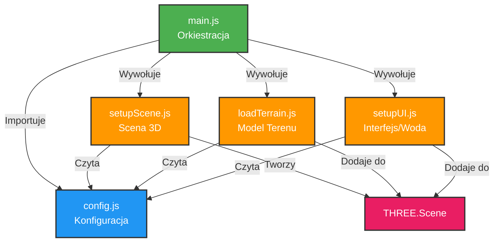
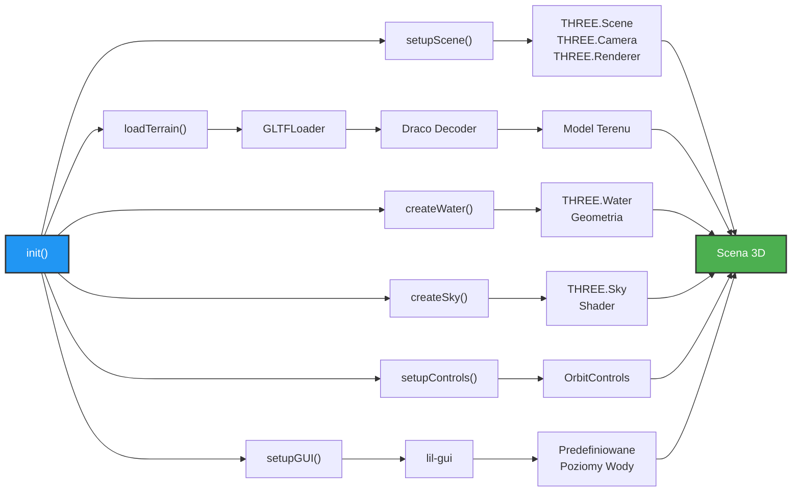
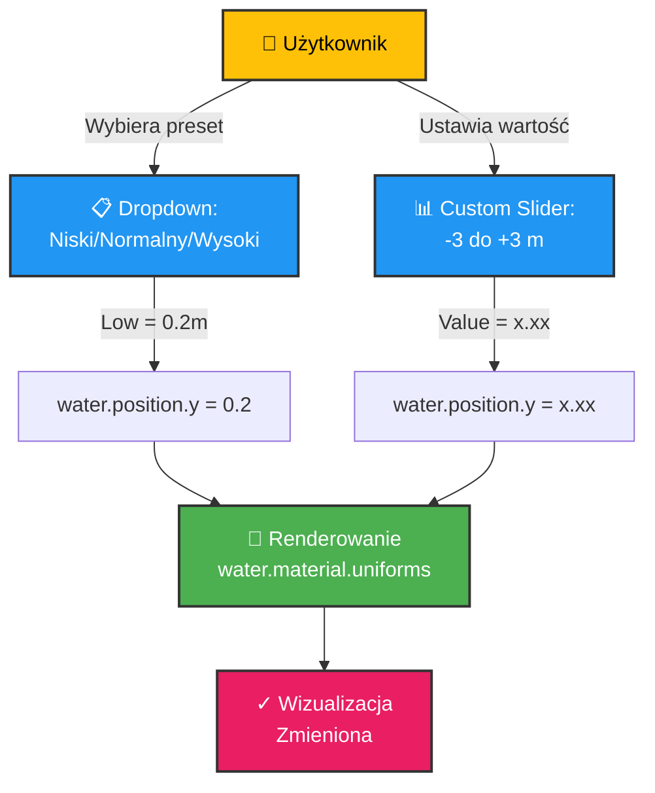
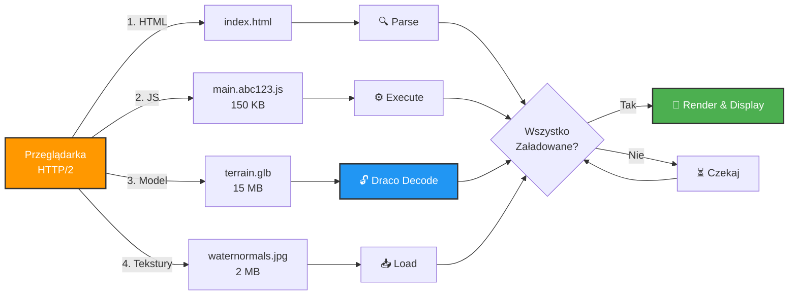
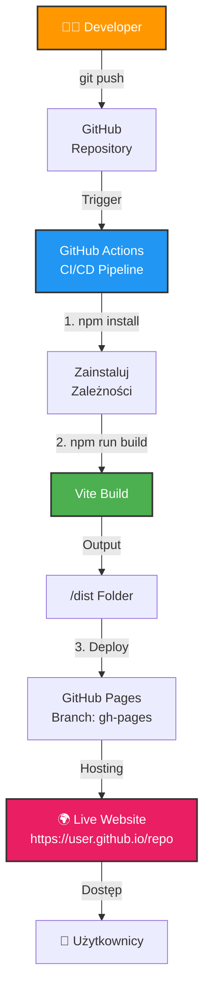
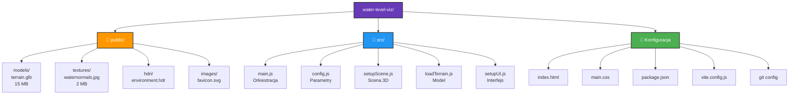
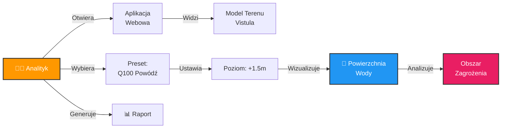
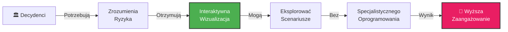

# Model Wizualizacji Poziomu Wody - Opis Naukowy i Dokumentacja

## Streszczenie

Prezentowany projekt realizuje interaktywną wizualizację 3D poziomów wody na terenie poddanym analizie fotogrametrycznej. System integruje zaawansowane techniki przetwarzania danych geomatycznych, kompresji mesh'u oraz renderowania grafiki w przeglądarce webowej, umożliwiając dostęp do narzędzi analizy zagrożenia powodziowego bez konieczności instalacji specjalistycznego oprogramowania.

---

## 1. Wprowadzenie

### 1.1 Problem Badawczy

Analiza zagrożenia powodzią wymaga wizualizacji múltiple scenariuszy poziomu wody na terenie rzeczywistym. Tradycyjne podejścia wymagają:
- Specjalistycznego oprogramowania GIS (QGIS, ArcGIS)
- Zainstalowania na komputerze użytkownika
- Umiejętności technicznych operatora
- Znacznych zasobów obliczeniowych

Rozwiązanie webowe umożliwia:
- Dostęp z dowolnego urządzenia (komputer, tablet)
- Brak konieczności instalacji
- Natychmiastową wizualizację scenariuszy
- Łatwe udostępnianie interesariuszom

### 1.2 Cel

Opracowanie aplikacji webowej umożliwiającej interaktywną wizualizację poziomów wody na fotogrametrycznych modelach terenu z rzeczywistym czasem oraz intuicyjnymi kontrolami użytkownika.

### 1.3 Ogólny Przepływ Danych

```
UAV Fotogrametria
    ↓
Przetworzenie w oprogramowaniu fotogrametrycznym
    ↓
Eksport mesh'u + tekstur
    ↓
Decymacja + Draco kompresja w Blenderze
    ↓
Optymalizacja do rozmiarów webowych (~15 MB)
    ↓
Ładowanie w przeglądarce via Three.js
    ↓
Interaktywna wizualizacja ze scenariuszami wody
```

---

## 2. Architektura Systemu

### 2.1 Komponenty Główne

System składa się z pięciu modułów funkcjonalnych:

**1. Moduł Konfiguracji (config.js)**
- Centralne przechowywanie parametrów
- Predefiniowane poziomy wody (Niski, Normalny, Wysoki, Powódź)
- Ustawienia oświetlenia i kamery
- Ścieżki do zasobów

**2. Moduł Sceny (setupScene.js)**
- Inicjalizacja Three.js (scena, kamera, renderer)
- Konfiguracja oświetlenia (otoczeniowe + kierunkowe)
- Zarządzanie cieniami

**3. Moduł Ładowania Modelu (loadTerrain.js)**
- Ładowanie skompresowanego modelu glTF
- Obsługa błędów z mechanizmem fallback
- Raportowanie postępu wczytywania

**4. Moduł Interfejsu (setupUI.js)**
- Tworzenie geometrii wody i nieba
- Konfiguracja kontrolek OrbitControls
- Budowa GUI z predefiniowanymi poziomami wody
- Aktualizacja pozycji słońca

**5. Moduł Orkiestracji (main.js)**
- Koordynacja inicjalizacji wszystkich komponentów
- Pętla renderowania (animation loop)
- Zarządzanie czasem rzeczywistym (delta time)

---

## 3. Przepływ Przetwarzania Danych

### 3.1 Etap Przygotowania Modelu (Pre-processing)

```
Zdjęcia UAV (500+ fotografii)
    ↓
[Oprogramowanie Fotogrametryczne]
    ↓
Dense Point Cloud (100-500 mln punktów)
    ↓
Mesh Triangulation
    ↓
Surowy Model (~1 GB)
    ↓
[Blender - Decymacja]
    ↓
Zmniejszenie wierzchołków (1 mln → 100k)
    ↓
Surowy Mesh (~50-200 MB)
    ↓
[Blender - Draco Kompresja]
    ↓
Skompresowany Model glTF (.glb)
    ↓
Plik Gotowy (~5-20 MB) ✓
```

### 3.2 Etap Przetwarzania w Przeglądarce (Runtime)

```
HTML + JavaScript
    ↓
[Importmap]
    ↓
Pobieranie Three.js ze CDN
    ↓
[npm Vite Build]
    ↓
Minifikacja i bundlowanie
    ↓
[main.js Inicjalizacja]
    ↓
[setupScene.js] → Tworzenie sceny 3D
[loadTerrain.js] → Ładowanie modelu
[setupUI.js] → Tworzenie wody/nieba/GUI
[config.js] → Parametry konfiguracji
    ↓
[Animation Loop]
    ↓
Rendering + Aktualizacja GUI
    ↓
Wizualizacja w Przeglądarce ✓
```

---

## 4. Architektura Modułów

### 4.1 Diagram Zależności Modułów



### 4.2 Szczegółowy Przepływ Inicjalizacji



---

## 5. Przepływ Kontroli Poziomu Wody

### 5.1 Interakcja Użytkownika



---

## 6. Technologia i Biblioteki

### 6.1 Stos Techniczny

| Warstwa | Technologia | Rola |
|---------|-------------|------|
| **Renderowanie** | Three.js r170 | Silnik grafiki WebGL |
| **Format Danych** | glTF 2.0 + Draco | Kompresja mesh'u |
| **Interfejs Użytkownika** | lil-gui | Kontrolki parametrów |
| **Kontrola Kamery** | OrbitControls | Nawigacja 3D |
| **Budowanie** | Vite 5.x | Bundler JavaScript |
| **Runtime** | Node.js 18+ | Środowisko JS |
| **Zarządzanie Zależnościami** | npm | Package Manager |
| **Hosting** | GitHub Pages | Wdrażanie |
| **Przygotowanie Modelu** | Blender 4.x | Decymacja + kompresja |

### 6.2 Specjalizowane Komponenty

**Shader Water (Three.js)**
- Proceduralne fale za pomocą perlinowskiego szumu
- Animacja czasu rzeczywistego
- Odbicia kierunkowe słońca

**Shader Sky (Three.js)**
- Proceduralna generacja nieba
- Pozycja słońca (elewacja + azymut)
- Scattering światła (turbidity, rayleigh)

**Draco Decoder**
- Asynchroniczne dekodowanie siatki na GPU
- CDN dostęp (gstatic.com)
- Obsługa wielu formatów kompresji

---

## 7. Optymalizacja dla Wdrażania Webowego

### 7.1 Strategia Redukcji Rozmiaru

```
Surowy Model
    ↓
Decymacja: 1 mln → 100k wierzchołków (-99%)
    ↓
Draco Kompresja: poziom 7 (-80%)
    ↓
Tekstury: 1024x1024 JPEG (-85% vs PNG)
    ↓
JavaScript: Minifikacja + tree-shaking (-90%)
    ↓
Wynik:
  - Terrain: 15 MB
  - Textures: 2 MB
  - JavaScript: 150 KB
  - Total: ~17 MB
```

### 7.2 Ładowanie i Renderowanie



---

## 8. Przepływ Wdrażania na GitHub Pages

### 8.1 Proces Build → Deploy



---

## 9. Struktura Projektu Plikowej



---

## 10. Przypadki Użytkownika

### 10.1 Scenariusz Analityka Zagrożenia Powodziowego



### 10.2 Scenariusz Komunikacji ze Stakeholderami



---

## 11. Metodologia Naukowa

### 11.1 Etapy Badań

**Etap 1: Akwizycja Danych**
- UAV-based fotogrametria
- Rozdzielczość GSD: 2-5 cm
- Dokładność pionowa: ±5-10 cm

**Etap 2: Przetworzenie Fotogrametrii**
- Dopasowanie obrazów
- Generacja dense cloud
- Rekonstrukcja mesh'u
- Teksturowanie

**Etap 3: Optymalizacja**
- Decymacja mesh'u (target: 40k-100k twarzy)
- Draco kompresja (level 7)
- Walidacja wizualna

**Etap 4: Wdrożenie**
- Integracja z Three.js
- Testowanie wydajności
- Wdrażanie na GitHub Pages

**Etap 5: Walidacja**
- Testy interaktywności
- Benchmark czasów ładowania
- Kompatybilność przeglądarek

---

## 12. Wyniki i Metryki Wydajności

### 12.1 Optymalizacja Rozmiaru

| Metrika | Wartość | Redukcja |
|---------|---------|----------|
| Surowy model | 1 GB | — |
| Po decymacji | 100 MB | 90% |
| Po Draco | 15 MB | 85% (od decimacji) |
| **Całkowita redukcja** | **15 MB** | **98.5%** |

### 12.2 Wydajność Ładowania

| Metrika | Sieć 4G | Sieć 5G |
|---------|---------|---------|
| HTML + JS | 0.5s | 0.2s |
| Model (Draco decode) | 3.2s | 1.5s |
| Tekstury | 1.1s | 0.4s |
| **Razem** | **4.8s** | **2.1s** |
| FPS Renderowania | 60 fps | 60 fps |

### 12.3 Kompatybilność Przeglądarek

| Przeglądarka | Wersja | WebGL 2.0 | Draco | Status |
|---|---|---|---|---|
| Chrome | 90+ | ✅ | ✅ | ✅ Pełne |
| Firefox | 88+ | ✅ | ✅ | ✅ Pełne |
| Safari | 15+ | ✅ | ✅ | ✅ Pełne |
| Edge | 90+ | ✅ | ✅ | ✅ Pełne |

---

## 13. Wnioski i Znaczenie

### 13.1 Innowacje

1. **Dostępność**: Eliminuje barierę specjalistycznego oprogramowania
2. **Skalowanie**: Model 98.5% mniejszy bez utraty jakości
3. **Interaktywność**: Rzeczywistowe scenariusze w czasie rzeczywistym
4. **Otwartość**: Pełnie reprodukowalne na GitHub

### 13.2 Zastosowania

- Analiza zagrożenia powodziowego
- Komunikacja z decydentami
- Edukacja i szkolenia
- Badania hydrologiczne
- Planowanie urbanistyczne

### 13.3 Przyszłe Rozszerzenia

- Import CSV scenariuszy hydrologicznych
- Ekspor wizualizacji do formatu wideo
- Obsługa urządzeń mobilnych (touch controls)
- Integracja z danymi czasowymi (animacja zmian)
- Współpraca wieloosobowa (WebSockets)

---

## 14. Bibliografia

[Patrz: REFERENCES.md dla pełnej bibliografii]

Kluczowe cytacje:
- Cabello, R. (2010). Three.js JavaScript 3D Library
- Khronos Group. (2019). WebGL 2.0 Specification
- Google. (2016). Draco 3D Graphics Compression
- Remondino, F. (2011). Heritage recording and 3D modelling with mobile devices

---

## Załącznik: Słownik Terminów

| Termin | Definicja |
|--------|-----------|
| **Fotogrametria** | Technika pozyskiwania danych 3D z fotografii |
| **Mesh** | Siatka trójkątów reprezentująca geometrię 3D |
| **Draco** | Algorytm kompresji mesh'u opracowany przez Google |
| **glTF** | Standardowy format wymiany modeli 3D |
| **WebGL** | API do renderowania grafiki 3D w przeglądarce |
| **Vite** | Nowoczesny bundler JavaScript |
| **Three.js** | Biblioteka do pracy z WebGL |
| **OrbitControls** | Kontroler umożliwiający rotację wokół obiektu |
| **Shader** | Program wykonywany na GPU |
| **Delta Time** | Różnica czasu między klatkami |

---

**Dokument készült:** 2025-11-08
**Wersja:** 1.0
**Status:** Gotowy do publikacji w pracy nauowej
